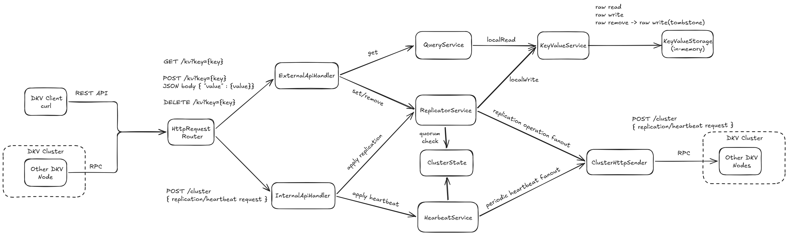
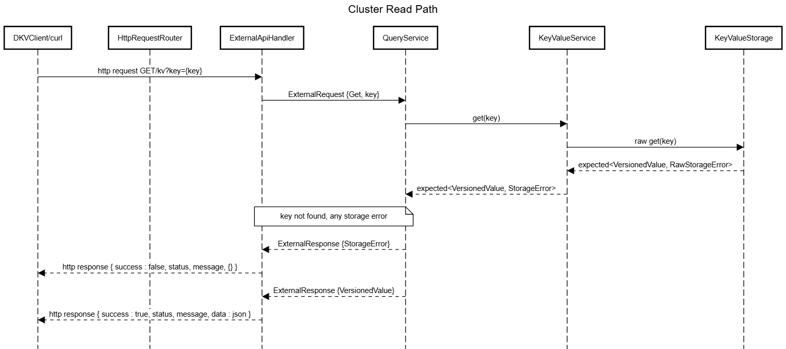
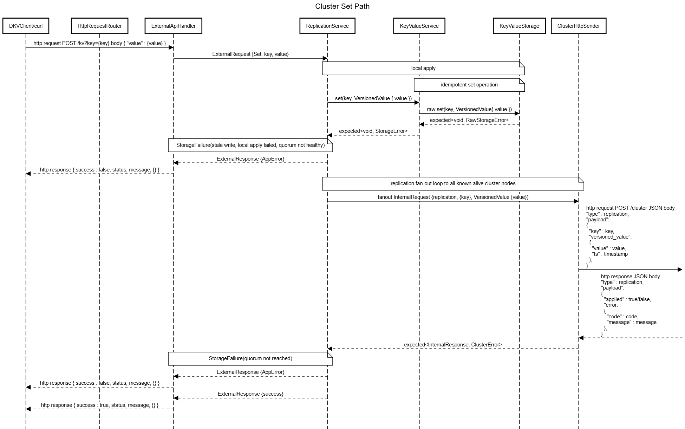
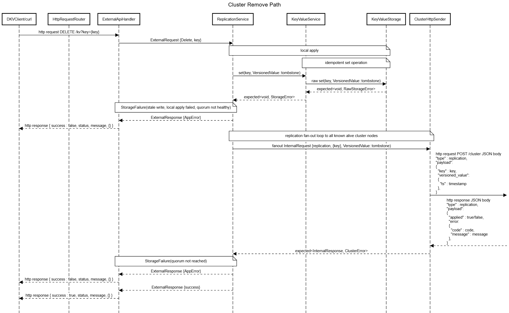
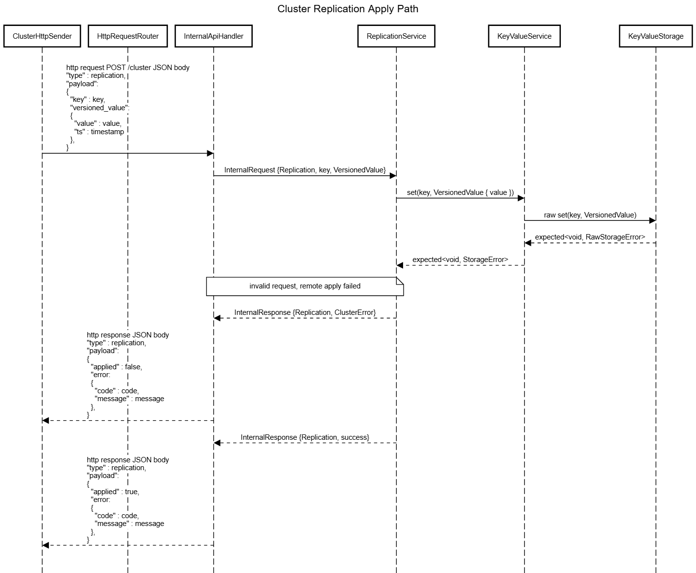

# DKV Storage


## Purpose
Distributed Key-Value Store - minimal yet realistic distributed system built to explore the core principles of distributed systems:

- Data replication across nodes
- Cluster membership and heartbeat mechanism
- quorum-based decision-making
- conflict handling and tombstone-based deletes
- separation of external and internal APIs

The goal of the project is to implement distributed key-value from scratch, using only lightweight libraries for HTTP, JSON, and testing without relying on any distributed-systems frameworks.

## Table of Contents
- [Purpose](#purpose)
- [Dependencies](#dependencies)
- [Functionality](#functionality)
    - [Replication across nodes](#replication-across-nodes)
    - [Tombstone-based deletes](#tombstone-based-deletes)
    - [Heartbeat mechanism](#heartbeat-mechanism)
    - [Cluster state & quorum checks](#cluster-state--quorum-checks)
    - [In-memory storage layer](#in-memory-storage-layer)
- [API Reference](#api-reference)
    - [External API](#external-api)
        - [Post body](#post-body)
        - [External API responses](#external-api-responses)
            - [GET Success](#get-success)
            - [GET Failure](#get-failure)
            - [POST/DELETE Success](#postdelete-success)
            - [POST Failure (invalid JSON body)](#post-failure-invalid-json-body)
            - [DELETE Failure (missing 'key' param)](#delete-failure-missing-key-param)
    - [Internal RPC API](#internal-rpc-api)
        - [Internal RPC requests](#internal-rpc-requests)
            - [Replication fan-out set request](#replication-fan-out-set-request)
            - [Replication fan-out remove request](#replication-fan-out-remove-request)
            - [Heartbeat fan-out request](#heartbeat-fan-out-request)
        - [Internal RPC responses](#internal-rpc-responses)
            - [Replication/Heartbeat apply response](#replicationheartbeat-apply-response)
- [Quick start](#quick-start)
    - [Start the cluster node](#start-the-cluster-node)
    - [Example requests (curl)](#example-requests-curl)
    - [Example requests (DKV Client)](#example-requests-dkv-client)
- [Tasks/Goals](#tasksgoals)

## Architecture Overview
DKV node consists of:

 - External API layer - handles client GET/SET/DELETE requests over HTTP, performs JSON parsing, unified external response formatting
 - Internal RPC layer - handles replication and heartbeat messages
 - Cluster State - maintains cluster nodes list, heartbeat timestamps, liveness information and quorum evaluation
 - Replication Service - fan-out propagation of writes and deletes to all peers, replication-apply logic, versioning
 - Storage engine - in-memory key/value map with versioning and tombstones
 - Background tasks - periodic heartbeat sender, compaction loop

 This structure keeps system modular and makes each subsystem easy to reason about, test, and extend

## Dependencies

|    Library   |	                 Purpose                      |
|--------------|------------------------------------------------|
| [cpp-httplib](https://github.com/yhirose/cpp-httplib)  |	HTTP server & client for REST and internal RPC|
|[nlohmann::json](https://github.com/nlohmann/json)|	JSON serialization/deserialization            |
|[GoogleTest (gtest)](https://github.com/google/googletest)|	unit testing framework |

## Functionality

### Replication across nodes
Every write or delete:

- is applied locally
- is propagated to all other nodes via the internal cluster protocol
- is processed by the Internal API on remote nodes
- is written/applied to their local storage

Replication uses a fan-out model: each node sends updates to all known peers

### Tombstone-based deletes

DELETE operations create a tombstone record of removing the key immediately. This ensures:

- consistent deletion across the cluster
- no resurrection of removed keys - LWW-inspired
- compatibility with future compaction

### Heartbeat mechanism

Each node periodically sends heartbeat messages to all other nodes.

Heartbeat:

- Updates nodes liveness
- allows failure detection
- feeds into quorum evaluation

### Cluster State & Quorum checks

The system maintains an in-memory cluster state:

- list of nodes
- last heartbeat timestamp
- node availability
- quorum evaluation logic

### In-memory storage layer

The storage backend is a simple in-memory key-value map with:

- raw read
- raw write
- raw remove → tombstone write

## API Reference

### External API
|Method|Endpoint| Body | Description |
|------|--------|------|-------------|
|GET|/kv?key={key}| none | read a value|
|POST| /kv?key={key}| JSON { "value" : ... } | write a value|
|DELETE| /kv?key={key}| none | delete (tombstone)|

Write/delete operations automatically trigger replication to other nodes

#### POST body
```json
{
    "value" : "your_value"
}
```
#### External API responses
##### GET Success
```json
{
    "success":true,
    "status":"OK",
    "message":"Operation completed successfully",
    "data": {
        "ts":1774474213490,
        "value":"hello"
    }
}
```
##### GET Failure
```json
{
    "success":false,
    "status":"LOCAL_STORAGE_ERROR",
    "message":"Key not found"
}
```
##### POST/DELETE Success
```json
{
    "success":true,
    "status":"OK",
    "message":"Operation completed successfully"
}
```
##### POST Failure (invalid JSON body)
```json
{
    "success":false,
    "status":"INVALID_REQUEST",
    "message":"[json.exception.parse_error...] parse error..."
}
```
##### DELETE Failure (missing key param)
```json
{
    "success":false,
    "status":"INVALID_REQUEST",
    "message":"Missing param 'key'"
}
```

### Internal RPC API
|Method|Endpoint| Body | Description |
|------|--------|------|-------------|
|POST| /cluster| JSON | Internal RPC|

#### Internal RPC message types
| Type | Meaning |
|------|---------|
|0|heartbeat|
|1|replication|


#### Internal RPC requests
##### Replication fan-out SET request
```json
{
    "type" : 1,
    "payload" : {
        "key" : "your_key_value",
        "versioned_value" : {
            "value" : "your_value",
            "ts" : "timestamp_value"
        }
    }
}
```
##### Replication fan-out REMOVE request
```json
{
    "type" : 1,
    "payload" : {
        "key" : "your_key_value",
        "versioned_value" : {
            "ts" : "timestamp_value"
        }
    }
}
```
##### Heartbeat fan-out request
```json
{
    "type" : 0,
    "payload" : {
        "node" : "sender_node_id",
        "timestamp" : "timestamp_value"
    }
}
```
#### Internal RPC responses
#### Internal RPC message types
| Type | Meaning |
|------|---------|
|0|invalid|
|1|heartbeat|
|2|replication|
##### Replication/Heartbeat apply response
```json
{
    "type" : 1/2,
    "payload" : {
        "applied" : "true/false",
        "error" : { //replication error
            "code" : "uint32 error",
            "message" : "error message"
        }
    }
}
```
##### Cluster failure response
```json
{
    "type" : 0,
    "error" : { // cluster error
        "code" : "uint32 error",
        "message" : "error message"
    }
}
```


## Sequence Diagrams

### Read path

### Set path

### Remove path

### Replication apply path

## Quick Start

### Start the cluster node
Each node requires:
 - '--node' - unique node name/id
 - '--host' - IP address to bind
 - '--port' - port for external and internal API
 - '--peer' - other node from a cluster
```bash
./dkv_server --node nodeX \
      --host 127.0.0.1\
      --port 8080\
      --peer node1@127.0.0.1:8081\
      --peer node2@127.0.0.1:8082
```
### Example requests (curl)
Write value:
```bash
curl -X POST "http://127.0.0.1:8080/kv?key=test" \
     -H "Content-Type: application/json" \
     -d "{\"value\": \"hello\" }"
```
Read value:
```bash
curl "http://127.0.0.1:8080/kv?key=test"
```
Remove value:
```bash
curl -X DELETE "http://127.0.0.1:8080/kv?key=test"
```
### Example requests (DKV Client)
You can use [DKV Client](https://github.com/metrofun-repo/DKV-Client) SDK tool for testing

## Tasks/Goals

### Core features
- [x] Basic HTTP API (GET/POST/DELETE)
- [x] Unified error handling
- [x] Unified request/response envelope types
- [x] JSON serialization layer
- [x] Concurrent periodic task


### Cluster protocol
 - [x] Internal cluster RPC
 - [x] Unified cluster sender (RPC fan-out)
 - [x] Replication fan-out
  - [x] Replication handlers
 - [x] Heartbeat mechanism
    - [x] Heartbeat handler
    - [x] Heartbeat loop (periodic task)
 - [x] Cluster state tracking
 - [x] Quorum evaluation
 - [ ] Async communication between nodes
    - [ ] Thread pool
    - [ ] Safe concurrent access 
    - [ ] Async handlers/senders
 - [ ] Use lock-free queues  

### Storage & data model
 - [x] In-memory key-value storage
 - [x] LWW-inspired tombstone deletes
 - [x] Compaction process
 - [ ] Persistent storage
 
### Infrastructure & Tooling 
 - [x] CMake project setup
 - [x] Project folder structure
 - [x] Integrate cpp-httplib
 - [x] Integrate nlohmann::json lib
 - [x] Integrate GoogleTest
 - [x] Parse cluster config from arguments
 - [ ] Logger
 - [ ] WAL-logger